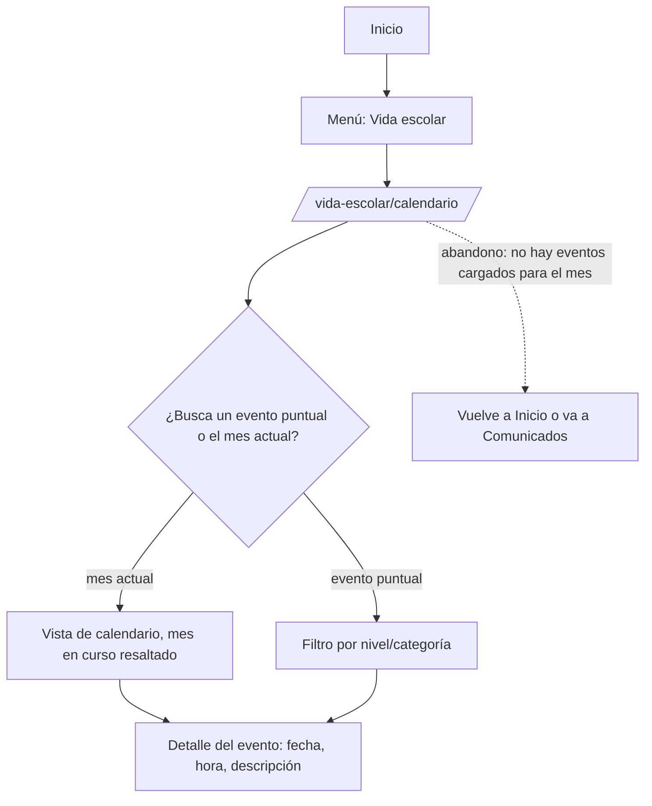

> **Nota de estructura multiidioma:** todo lo que sigue (mapa del sitio, navegación, flujos,
> wireframes) se diseñó para funcionar **igual en español y en italiano**, según ADR-002. La
> arquitectura no cambia según el idioma — lo único que cambia es (a) el contenido de cada nodo
> (traducido) y (b) la visibilidad del selector de idioma, que solo aparece si el interruptor
> "italiano habilitado" está activo en la configuración global. Las URLs en italiano son un
> espejo exacto de las españolas bajo el prefijo `/it/...` (ej. `/institucion/historia` →
> `/it/istituzione/storia`, con slugs también traducidos — a definir en Fase 2/3, no en Fase 1).

# 02 — UX y arquitectura de información (Fase 1)

Estado: **completo**
Herramienta: `ux-flow-designer`

---

## 1. Audiencias

| Audiencia | Qué viene a buscar | Prioridad | % estimado del tráfico |
|---|---|---|---|
| Padres que están evaluando el colegio | Propuesta educativa (español + italiano), niveles, cómo es la institución, aranceles/costos, cómo inscribir, ubicación y contacto | **Alta — decide la compra** | Sin datos (bloqueado por pregunta abierta #8 de `docs/01`, sin acceso a Analytics/Search Console) |
| Padres de alumnos actuales | Calendario académico, comunicados, noticias, documentos (circulares, estatutos), contacto directo con secretaría/administración | Alta | Sin datos |
| Alumnos (secundaria/instituto de idiomas) | Eventos, galería de actividades, cursos de italiano, calendario | Media | Sin datos |
| Docentes / postulantes a docencia | Sin contenido dedicado hoy en el inventario (ninguna de las 39 piezas es "trabajá con nosotros"). No se crea una sección nueva porque el cliente no la pidió — si se necesita, un enlace de contacto/mail bajo Institución o Contacto alcanza; ver nota en §3 | Baja | Sin datos |
| Ex-alumnos | Convenio con la Asociación de Ex Alumnos (contenido existente, 2017, vigencia a confirmar — pregunta nueva #17 en `docs/01` §E) | Baja | Sin datos |
| Prensa / instituciones | Historia, autoridades, certificación internacional, hitos institucionales (visita del presidente de Italia, aniversarios) | Media | Sin datos |

> El sitio institucional educativo tiene un sesgo fuerte: la audiencia que **decide la compra**
> son los padres que evalúan. Si la arquitectura no los sirve primero, el sitio no cumple su
> función comercial, por más completo que sea para los demás. Por eso "Admisiones" es un ítem
> de primer nivel del menú (no un sub-ítem de "Institución"), y la home prioriza oferta
> educativa + CTA de inscripción antes que la historia institucional (al revés de lo que hace
> el sitio actual, donde la home muestra por accidente la página "Historia" — ver §3, nota de
> arquitectura sobre la home).

---

## 2. Tareas principales por audiencia

Ordenadas por frecuencia × importancia. Cada tarea tiene que resolverse en ≤ 3 clics desde `/`.

| # | Audiencia | Tarea | Frecuencia | Importancia | Ruta a ≤3 clics | ¿Resuelta hoy? |
|---|---|---|---|---|---|---|
| 1 | Padres evaluando | Entender la propuesta educativa (niveles, bilingüismo español/italiano) | Alta | Alta | Inicio → Oferta educativa (1 clic) | Parcial — existe contenido (Instituto de Lengua y Cultura, Cursos de Italiano) pero sin landing que los agrupe |
| 2 | Padres evaluando | Saber cómo inscribir a mi hijo | Alta | **Crítica** | Inicio → Admisiones (1 clic) → formulario de pre-inscripción (2 clics) | Sí, pero disperso en 2 páginas sin relación jerárquica (`/inscripciones-2/`, `/formulacion-de-pre-inscripcion/`) |
| 3 | Padres evaluando | Contactar a secretaría / pedir información | Alta | Alta | Inicio → Contacto (1 clic) | Sí, pero la página actual tiene 4661 palabras (mezcla de contenidos, ver §3) |
| 4 | Padres actuales | Ver el calendario académico / próximos eventos | Alta | Alta | Inicio → Vida escolar → Calendario académico (2 clics) | **No** — no existe hoy como contenido propio (pedido nuevo del cliente, `docs/01` §E #5) |
| 5 | Padres actuales | Leer comunicados/circulares recientes | Alta | Alta | Inicio → Vida escolar → Comunicados (2 clics) | Parcial — hoy son entradas de blog sueltas (ej. comunicado 05/05/2020), sin tipo de contenido propio |
| 6 | Padres actuales | Descargar un documento (estatutos, circular, ficha) | Media | Alta | Inicio → Documentos (1 clic) o desde la página institucional relacionada | Sí, con contenido duplicado por sede sin fusionar |
| 7 | Padres/alumnos | Ver noticias recientes del colegio | Media | Media | Inicio → Noticias (1 clic) | Sí, con "Noticias" y "Novedades" duplicadas |
| 8 | Todas | Ubicar el colegio (dirección, mapa, teléfono) | Media | Alta | Inicio → Contacto (1 clic) | Sí, dentro de la página de contacto |
| 9 | Padres/alumnos | Ver fotos de actividades y eventos (galería) | Media | Media | Inicio → Vida escolar → Galería (2 clics) | Sí, duplicada por sede sin fusionar |
| 10 | Prensa/institucional | Conocer la historia y autoridades del colegio | Baja | Media | Inicio → Institución → Historia/Autoridades (2 clics) | Sí |
| 11 | Ex-alumnos | Ver info del convenio con la Asociación de Ex Alumnos | Baja | Baja | Inicio → Institución → Convenio Ex Alumnos (2 clics) | Sí, como noticia de 2017 en vez de página institucional (vigencia a confirmar) |

---

## 3. Card sorting → arquitectura nueva

Partiendo del inventario de `docs/01-analisis-descubrimiento.md` §C.2 (26 páginas + 13 entradas
= 39 piezas). **Regla aplicada, según la respuesta del cliente a la pregunta #4:** no se
descarta nada unilateralmente. Toda pieza tiene un destino explícito — migrar, fusionar,
archivar (visible pero fuera de navegación principal) o crear. Los casos que en un proyecto sin
esa restricción serían candidatos obvios a borrar (contenido de instalación de WordPress,
entradas de prueba, eventos puntuales de hace casi una década) se marcan como **archivar** +
**pregunta nueva al cliente** en vez de asumir la baja. Ver preguntas #14–#20 agregadas a
`docs/01-analisis-descubrimiento.md` §E.

### Agrupaciones resultantes (tareas del usuario, no organigrama)

1. **Institución** — quiénes somos, historia, autoridades, administración, misión/visión,
   certificación internacional, estatutos, convenio ex-alumnos.
2. **Oferta educativa** — Instituto de Lengua y Cultura, Cursos de Italiano (landing nueva que
   agrupa ambas, ver "contenido nuevo").
3. **Admisiones** — inscripciones (contenido activo 2026), formularios de pre-inscripción.
4. **Vida escolar** — eventos, galería, biblioteca, enlaces de interés, calendario académico
   (nuevo), comunicados (nuevo).
5. **Noticias** — blog institucional (fusión de "Noticias" + "Novedades").
6. **Documentos** — descargas institucionales (fusión de las dos páginas de documentos).
7. **Contacto** — datos de contacto, mapa, formulario.

### Contenido que se fusiona

| Páginas viejas | Página nueva | Motivo |
|---|---|---|
| `/noticias/` + `/novedades/` | `/noticias` (listado único) | Mismo propósito funcional — dos listados de blog con nombres distintos, sin diferencia editorial real |
| `/descarga-de-documentos/` + `/descarga-documentos-fndo-de-la-mora/` | `/documentos` (listado único, con filtro por sede si la sede Fernando de la Mora sigue vigente — pregunta #14) | Mismo tipo de contenido (documentos descargables), separados hoy solo por sede |
| `/galeria/` + `/galeria-sede-fndo/` | `/vida-escolar/galeria` (con filtro por sede, misma condición que arriba) | Mismo tipo de contenido (galería de fotos), separado hoy solo por sede |

### Contenido que se archiva (no se descarta — queda con URL propia, fuera de menús/listados activos)

> Ninguno de estos se elimina. Se migra igual, con `estado = archivado` (visible por URL directa
> y en el buscador interno si corresponde, pero sin aparecer en el listado principal de
> Noticias/Eventos ni en el menú). La decisión de bajarlos definitivamente queda en manos del
> cliente — ver preguntas nuevas.

| Página/entrada vieja | Por qué es candidata | Pregunta asociada |
|---|---|---|
| `/pagina-ejemplo/` | Contenido de instalación por defecto de WordPress, nunca editado desde 2016 | #15 |
| `/noticia-de-prueba-1/`, `/noticia-de-prueba-2/`, `/noticia-de-prueba-3/` | Contenido de prueba explícito en el título, sin valor editorial | #15 |
| `/semana-de-la-juventud-y-fiesta-de-la-primavera-tematica-hippiechic/`, `/invitacion/`, `/festejo-del-dia-del-folklore-nivel-inicial/` | Entradas de 2016 con 11–27 palabras, prácticamente sin contenido | #16 |
| `/invitaciones/` | Página de 2023 sin fecha de evento claro en el título — posible contenido de un evento puntual ya pasado | #16 |
| `/comunicado-05052020/` | Comunicado puntual de la pandemia (2020), de interés histórico más que operativo | #18 |
| `/domenica-di-sapori-italiani-feria-familiar-de-la-gastronomia-italiana/`, `/concierto-de-piano-de-mateo-servian-sforza/` | Eventos puntuales de 2017, ya pasados | Sin pregunta nueva — se archivan por antigüedad y tipo (evento cerrado), no requieren confirmación adicional del cliente |

### Contenido que requiere revisión editorial antes de fijar destino final

| Página vieja | Situación | Pregunta asociada |
|---|---|---|
| `/contacto/` | 4661 palabras, muy por encima de lo típico para una página de contacto — probable mezcla de contenido de más de una sección (Divi permite anidar bloques de otras páginas) | #19 |
| `/formulacion-de-pre-inscripcion/` y `/formulario-de-pre-inscripcion-sede-fernando-de-la-mora/` | El destino actual de ambos formularios es un mail de una agencia externa (`comunica@pressencia.com.py`), no de Dante | #20 |
| `/convenio-con-la-asociacion-de-ex-alumnos-del-colegio-dante-alighieri/` | Publicada como noticia en 2017 — si el convenio sigue vigente, el contenido pertenece a "Institución" como página permanente, no como noticia con fecha de caducidad editorial | #17 |

### Contenido nuevo que hay que crear

| Página/tipo nuevo | Motivo | Quién provee el contenido |
|---|---|---|
| **Calendario académico** (tipo de contenido propio, no una página de texto libre) | Pedido explícito del cliente (`docs/01` §E, pregunta #5): "hay calendario académico y comunicados que se publican con frecuencia" | Cliente/secretaría académica — vía panel, rol "editor académico" (`docs/01` §E, pregunta #2) |
| **Comunicados** (tipo de contenido propio, separado de Noticia) | Mismo pedido — un comunicado es urgente/operativo (ej. suspensión de clases), no editorial como una noticia; necesita comportamiento propio (fijado arriba del listado, fecha de vigencia) | Cliente/administración |
| **Landing "Oferta educativa"** | Hoy no existe una página que agrupe Instituto de Lengua y Cultura + Cursos de Italiano — es scaffolding estructural necesario para que el ítem de menú tenga destino, no contenido inventado: agrupa lo que ya existe con una bajada breve basada en hechos ya confirmados (colegio bilingüe español-italiano, afiliado a la Società Dante Alighieri) | Se arma en Fase 2 (copywriting) a partir del contenido migrado existente |
| **Landing "Institución"**, **landing "Vida escolar"**, **landing "Admisiones"** | Mismo caso: agregadores de las páginas hijas para que la navegación de 2° nivel tenga una pantalla propia en vez de redirigir directo al primer hijo | Fase 2, a partir de contenido existente |
| **Home nueva** | Ver nota de arquitectura abajo | Fase 2 |

### Nota de arquitectura — la home

Hallazgo de `docs/01` §C.2: la home real del sitio actual (`https://dante.edu.py/`) muestra el
contenido de la página **"Historia"**, mientras que la página con slug `/inicio/` está casi
vacía (36 palabras). Esto es un accidente de configuración de Divi, no una decisión de diseño.
**Decisión de arquitectura para el sitio nuevo:** la home se construye como una plantilla propia
armada con bloques (hero, oferta educativa destacada, CTA de admisiones, últimas
noticias/comunicados, cifras institucionales) — no es ni la vieja `/inicio/` ni un calco de
"Historia". El contenido de "Historia" migra íntegro a `/institucion/historia` como página
propia; la home la resume, no la reemplaza. El texto final de la home se redacta en Fase 2
(copywriting) a partir del contenido migrado, priorizando lo que necesitan los padres que
evalúan (§1), no la cronología institucional completa.

---

## 4. Mapa del sitio nuevo

```
Inicio (/)
├── Institución (/institucion)
│   ├── Quiénes somos (/institucion/quienes-somos)
│   ├── Historia (/institucion/historia)
│   ├── Misión, visión y valores (/institucion/mision-vision-valores)
│   ├── Autoridades (/institucion/autoridades)
│   ├── Acerca de la Sociedad Dante Alighieri (/institucion/sociedad-dante-alighieri)
│   ├── Certificación internacional (/institucion/certificacion-internacional)
│   ├── Estatutos sociales (/institucion/estatutos-sociales)
│   ├── Administración (/institucion/administracion)
│   └── Convenio con Ex Alumnos (/institucion/convenio-ex-alumnos) — sujeto a confirmación (#17)
├── Oferta educativa (/oferta-educativa)
│   ├── Instituto de Lengua y Cultura (/oferta-educativa/instituto-de-lengua-y-cultura)
│   └── Cursos de Italiano (/oferta-educativa/cursos-de-italiano)
├── Admisiones (/admisiones)
│   ├── Pre-inscripción (/admisiones/pre-inscripcion)
│   └── Pre-inscripción sede Fernando de la Mora (/admisiones/pre-inscripcion-fernando-de-la-mora) — sujeto a confirmación (#14)
├── Vida escolar (/vida-escolar)
│   ├── Calendario académico (/vida-escolar/calendario) — contenido nuevo
│   ├── Comunicados (/vida-escolar/comunicados) — contenido nuevo
│   ├── Eventos (/vida-escolar/eventos)
│   ├── Galería (/vida-escolar/galeria)
│   ├── Biblioteca "Irene Borello de Amodei" (/vida-escolar/biblioteca)
│   └── Enlaces de interés (/vida-escolar/enlaces-de-interes)
├── Noticias (/noticias)
│   └── [detalle de cada noticia] (/noticias/{slug})
├── Documentos (/documentos)
└── Contacto (/contacto)

Fuera del árbol de navegación (accesibles por URL/buscador, sin ítem de menú):
├── Resultados de búsqueda (/buscar)
├── Página de ejemplo (archivada) — ver pregunta #15
├── Noticias de prueba 1/2/3 (archivadas) — ver pregunta #15
├── Eventos 2016 de bajo contenido (archivados) — ver pregunta #16
└── 404
```

Profundidad máxima: **3 niveles** (Inicio → Sección → Página/detalle de noticia). Ningún
contenido del inventario necesita un cuarto nivel.

---

## 5. Navegación

| Ubicación | Contenido | Comportamiento |
|---|---|---|
| Menú principal (escritorio) | Institución · Oferta educativa · Admisiones · Vida escolar · Noticias · Contacto (6 ítems + logo=Inicio) | Institución/Oferta educativa/Vida escolar despliegan submenú con sus hijos al pasar el mouse; Admisiones, Noticias y Contacto son enlace directo (no tienen hijos de navegación, aunque Admisiones internamente tenga 2 páginas — el CTA principal ya lleva a la landing) |
| Menú principal (móvil) | Mismos 6 ítems, menú hamburguesa a pantalla completa, acordeón para los que tienen hijos | El botón "Admisiones" además se repite como CTA fijo (sticky) al pie de pantalla en móvil — es la tarea #2 de la tabla de §2, la de mayor importancia comercial |
| Barra de utilidades (encima del menú principal, escritorio) | Selector de idioma ES/IT (solo visible si el toggle de italiano está habilitado, ADR-002) · ícono de buscador · teléfono/WhatsApp de contacto (si el cliente confirma que lo suma, ver `docs/01` §C.3) | Selector de idioma cambia de rama sin perder la sección actual (ej. `/institucion/historia` ↔ `/it/istituzione/storia`) |
| Navegación contextual / lateral | Dentro de "Institución" y "Vida escolar": menú de sub-secciones visible en la propia página (lista de hermanos), no solo en el header | Ayuda a que los padres no tengan que volver al menú principal para saltar entre "Autoridades" y "Estatutos", por ejemplo |
| Pie de página | Logo (versión completa, con banderas PY/IT) · datos de contacto y mapa · enlaces a Documentos, Calendario académico, Estatutos sociales, Convenio Ex Alumnos · redes sociales · aviso legal/privacidad (Fase 2) · selector de idioma (repetido) | El pie es donde vive "Documentos" y "Calendario" como acceso secundario además de sus ítems dentro de la navegación primaria — refuerzo, no reemplazo |
| Migas de pan | En toda página de 2° y 3° nivel: `Inicio > Sección > Página` | No aparecen en Inicio ni en el listado principal de Noticias (sería redundante con el propio ítem del menú activo) |
| Buscador | Ícono en la barra de utilidades → página `/buscar` con campo de texto | Busca sobre Página, Noticia, Documento y Comunicado. Resultados con filtro por tipo de contenido (ver wireframe §9) |

**Regla aplicada:** el menú principal queda en **6 elementos** de primer nivel (por debajo del
máximo de 7), dejando margen explícito para que el cliente pueda agregar en el futuro un ítem
que hoy no tiene contenido que lo justifique (ej. "Trabajá con nosotros"), sin tener que sacar
otro.

---

## 6. Flujos de las tareas críticas

### Flujo 1 — "Quiero saber cómo inscribir a mi hijo" (padres evaluando)

```mermaid
flowchart TD
    A[Inicio] -->|clic en CTA "Admisiones" del hero o del menú| B[/admisiones/]
    B -->|lee requisitos y fechas| C{"¿Sede Asunción o Fernando de la Mora?"}
    C -->|Asunción| D[/admisiones/pre-inscripcion/]
    C -->|Fernando de la Mora| E[/admisiones/pre-inscripcion-fernando-de-la-mora/]
    D -->|completa nombre, teléfono, email| F[Formulario enviado]
    E -->|completa nombre, teléfono, email| F
    F --> G[Pantalla de confirmación: "te contactamos para coordinar la inscripción presencial"]
    B -.->|abandono: no encuentra fechas/requisitos claros| X[Sale del sitio o va a Contacto]
```

### Flujo 2 — "Quiero ver el calendario académico" (padres actuales)



### Flujo 3 — "Quiero contactar a la secretaría" (ambas audiencias principales)

```mermaid
flowchart TD
    A[Cualquier página] -->|clic en "Contacto" del menú o del pie| B[/contacto/]
    B --> C{"¿Quiere llamar/escribir o llenar formulario?"}
    C -->|teléfono/WhatsApp/mail| D[Datos de contacto directo + mapa]
    C -->|formulario| E[Completa nombre, teléfono, email, mensaje]
    E --> F[Envío con captcha]
    F --> G[Confirmación en pantalla + copia por mail]
    F -.->|captcha falla o error de validación| H[Mensaje de error inline, no pierde lo escrito]
```

### Flujo 4 — "Quiero ver noticias/comunicados recientes" (padres actuales)

```mermaid
flowchart TD
    A[Inicio] -->|ve bloque "Últimas noticias" o clic en menú| B[/noticias/]
    A -->|ve bloque "Comunicados" en home o Vida escolar| C[/vida-escolar/comunicados/]
    B --> D[Detalle de noticia]
    C --> E[Detalle de comunicado, con fecha de vigencia visible]
    D --> F[Enlace "volver a Noticias" + noticias relacionadas]
    E --> G[Enlace "volver a Comunicados"]
```

### Flujo 5 — "Quiero descargar un documento institucional" (padres actuales/evaluando)

```mermaid
flowchart TD
    A[Inicio o página institucional] -->|clic en "Documentos" del menú/pie| B[/documentos/]
    B --> C{"¿Filtra por sede o categoría?"}
    C -->|sí| D[Lista filtrada]
    C -->|no| E[Lista completa, ordenada por fecha]
    D --> F[Clic en el documento]
    E --> F
    F --> G[Descarga directa del PDF, nueva pestaña]
    B -.->|abandono: no encuentra el documento buscado| H[Usa el buscador general]
```

---

## 7. Tipos de contenido y sus campos

> Esto alimenta directo el modelo de datos de la Fase 3. Cuanto más preciso acá, menos
> retrabajo después. **Todo campo de texto editorial es traducible (ES/IT)** por ADR-002 — no
> se repite esa nota en cada fila, se asume en todos los campos marcados "texto" o "HTML" salvo
> que se indique lo contrario (slugs, fechas, relaciones y flags no se traducen).

### Página

| Campo | Tipo | Obligatorio | Nota |
|---|---|---|---|
| Título | texto (ES/IT) | sí | |
| Slug | texto | sí | editable, autogenerado por idioma |
| Sección (padre de menú) | relación | sí | Institución / Oferta educativa / Admisiones / Vida escolar |
| Página padre | relación | no | jerarquía interna dentro de una sección, máx. 1 nivel (profundidad 3 total) |
| Orden dentro del padre | número | no | para el submenú/navegación contextual |
| Bloques de contenido | repetidor | sí | ver catálogo de bloques §8 |
| Imagen de portada | medio | no | |
| SEO: título | texto (ES/IT) | no | por defecto = título |
| SEO: descripción | texto (ES/IT) | no | |
| SEO: imagen OG | medio | no | |
| Estado | enum | sí | borrador / publicado / archivado |
| Sede (si aplica) | enum | no | Asunción / Fernando de la Mora / ambas — usado por Documentos y Galería fusionados (§3), condicionado a la respuesta de la pregunta #14 |

### Noticia

| Campo | Tipo | Obligatorio | Nota |
|---|---|---|---|
| Título | texto (ES/IT) | sí | |
| Slug | texto | sí | |
| Bajada / excerpt | texto (ES/IT) | sí | usado en el listado y en OG |
| Contenido | HTML (ES/IT) | sí | vía bloques o rich text simple (a decidir en Fase 3) |
| Imagen destacada | medio | sí | obligatoria por consistencia visual del listado |
| Categoría | relación | no | ej. Institucional, Cultural, Deportivo — taxonomía simple |
| Fecha de publicación | fecha | sí | |
| Destacada (home) | booleano | no | para el bloque "últimas noticias" |
| Estado | enum | sí | borrador / publicado / **archivado** (usado para los casos de §3 "contenido que se archiva") |
| SEO: título / descripción / OG | texto (ES/IT) / medio | no | mismo bloque que Página |

### Documento

| Campo | Tipo | Obligatorio | Nota |
|---|---|---|---|
| Título | texto (ES/IT) | sí | |
| Archivo | medio (PDF/DOCX/XLSX) | sí | lista blanca de extensiones, `CLAUDE.md` §2 |
| Descripción breve | texto (ES/IT) | no | |
| Categoría | relación | no | ej. Estatutos, Circulares, Formularios |
| Sede | enum | no | Asunción / Fernando de la Mora / ambas |
| Fecha de publicación | fecha | sí | para ordenar el listado |
| Vigente / vencido | booleano | no | para circulares con fecha de caducidad |
| Estado | enum | sí | borrador / publicado / archivado |

### Comunicado

| Campo | Tipo | Obligatorio | Nota |
|---|---|---|---|
| Título | texto (ES/IT) | sí | |
| Contenido | HTML (ES/IT) | sí | texto corto, sin bloques complejos — es un aviso, no una página |
| Fecha de publicación | fecha | sí | |
| Fecha de vigencia (hasta) | fecha | no | pasada esa fecha deja de fijarse arriba del listado, pero no se borra (queda en el histórico) |
| Prioridad / fijado | booleano | no | para que aparezca destacado en home y en Vida escolar mientras esté vigente |
| Dirigido a | enum | no | Toda la comunidad / Sede Asunción / Sede Fernando de la Mora — condicionado a #14 |
| Estado | enum | sí | borrador / publicado / archivado |

### Evento de calendario académico

| Campo | Tipo | Obligatorio | Nota |
|---|---|---|---|
| Título | texto (ES/IT) | sí | |
| Descripción | texto (ES/IT) | no | |
| Fecha de inicio | fecha/hora | sí | |
| Fecha de fin | fecha/hora | no | para eventos de más de un día (ej. semana de exámenes) |
| Categoría/nivel | enum | no | ej. Inicial, Primaria, Secundaria, Instituto de Idiomas, Todo el colegio |
| Todo el día | booleano | no | |
| Enlace relacionado | relación | no | a una Noticia o Comunicado si el evento tiene más detalle en otro lado |
| Estado | enum | sí | borrador / publicado |

### Galería

| Campo | Tipo | Obligatorio | Nota |
|---|---|---|---|
| Título | texto (ES/IT) | sí | ej. "Aniversario 129" |
| Fecha | fecha | sí | |
| Sede | enum | no | Asunción / Fernando de la Mora / ambas — condicionado a #14 |
| Medios | repetidor de medios | sí | fotos y/o videos |
| Descripción | texto (ES/IT) | no | |
| Estado | enum | sí | borrador / publicado |

---

## 8. Catálogo de bloques de contenido

Los bloques que el cliente puede combinar para armar una página desde el panel. Ajustado al
inventario real: se agregan **Cifras/hitos institucionales** (aniversarios, visita del
presidente de Italia — hechos ya existentes en el contenido migrado) y **Selector de sede**
(condicionado a la pregunta #14); se mantiene el resto del catálogo de referencia porque el
inventario sí lo demanda (galerías, documentos descargables, FAQ para Admisiones, mapa y
formulario para Contacto).

| Bloque | Campos | Dónde se usa |
|---|---|---|
| Hero | título, bajada, imagen/video, CTA | Inicio, cabeceras de sección (Institución, Oferta educativa, Admisiones, Vida escolar) |
| Texto enriquecido | contenido HTML | Todas las páginas institucionales |
| Imagen + texto | imagen, posición, título, texto, CTA | Historia, Misión/Visión/Valores, Instituto de Lengua y Cultura |
| Galería | medios, disposición, filtro por sede | `/vida-escolar/galeria` |
| Tarjetas | repetidor (icono, título, texto, enlace) | Landing de Oferta educativa (Instituto de Lengua y Cultura / Cursos de Italiano), landing de Institución |
| Acordeón / FAQ | repetidor (pregunta, respuesta) | Admisiones (requisitos, fechas, preguntas frecuentes) |
| CTA destacado | título, texto, botón, fondo | Home (CTA a Admisiones), fin de páginas de Oferta educativa |
| Video | URL o archivo, portada | Historia, Noticias (si aplica) |
| Cifras / hitos institucionales | repetidor (número o año, etiqueta) | Home, Historia (129 aniversario, certificación internacional, visita del presidente de Italia) |
| Testimonios | repetidor (foto, nombre, rol, texto) | Home, Oferta educativa — solo si el cliente provee testimonios reales (no se inventan) |
| Mapa | dirección, coordenadas | Contacto |
| Formulario | selector de formulario (contacto / pre-inscripción por sede) | Contacto, Admisiones |
| Listado de noticias | categoría, cantidad | Home, `/noticias` |
| Listado de comunicados | cantidad, filtro por sede | Home, `/vida-escolar/comunicados` |
| Documentos descargables | repetidor (archivo, título) o consulta a categoría | `/documentos`, páginas institucionales con anexos (Estatutos, Administración) |
| Selector de sede | enum (Asunción / Fernando de la Mora) | `/documentos`, `/vida-escolar/galeria` — condicionado a la respuesta de la pregunta #14 |

> Menos bloques bien hechos > muchos bloques mediocres. Se empieza con estos 16 porque cada uno
> tiene al menos una pieza real del inventario que lo demanda; no se agregó ningún bloque
> especulativo.

---

## 9. Wireframes

Plantillas únicas wireframeadas (baja fidelidad, sin color, con contenido real aproximado — a
partir de los títulos y hechos confirmados del inventario, no texto de relleno). Cada archivo
HTML incluye la versión escritorio y, debajo, la versión móvil en el mismo documento (marcadas
con su propio encabezado `<h2>`), para no multiplicar archivos sin necesidad.

- [x] Inicio → `docs/wireframes/inicio.html`
- [x] Página institucional (con bloques) → `docs/wireframes/pagina-institucional.html`
- [x] Landing de sección / oferta educativa (equivalente a "sección de nivel educativo" del checklist) → `docs/wireframes/landing-seccion.html`
- [x] Listado de noticias → `docs/wireframes/listado-noticias.html`
- [x] Detalle de noticia → `docs/wireframes/detalle-noticia.html`
- [x] Contacto → `docs/wireframes/contacto.html`
- [x] Resultados de búsqueda → `docs/wireframes/busqueda.html`
- [x] 404 → `docs/wireframes/404.html`
- [x] Listado de documentos / descargas → `docs/wireframes/listado-documentos.html`

Ubicación de los archivos: **`docs/wireframes/`** (carpeta nueva creada en esta fase).

---

## 10. Mapa de redirecciones 301

> **Crítico para no perder SEO.** Este archivo se carga tal cual en el panel en la Fase 5.

Formato: CSV en **`docs/redirecciones-301.csv`** — las 39 URLs reales de `docs/01` §C.2 (26
páginas + 13 entradas), cada una con su URL nueva según la arquitectura de §4. Ver el archivo
completo; resumen de criterio:

- Contenido que migra 1 a 1 → redirige a su nueva URL definitiva.
- Contenido que se fusiona (Noticias/Novedades, Documentos por sede, Galería por sede) → todas
  las URLs viejas involucradas redirigen al mismo destino fusionado.
- Contenido que se archiva (§3) → redirige a su propia URL nueva archivada (no a Inicio): sigue
  existiendo, solo que fuera de menús/listados activos. Esto preserva el link equity mejor que
  redirigir todo a `/`.
- `/inicio/` y `/pagina-ejemplo/` → redirigen a `/` (home), por ser contenido casi vacío o de
  instalación por defecto sin URL propia razonable en la arquitectura nueva.
- Todas las filas quedan con `Verificada = NO` — se verifican una por una recién en la Fase 6
  (SEO técnico), cuando el sitio nuevo esté en staging.

La tabla completa (39 filas + encabezado) vive en el CSV, no se duplica en este documento para
evitar que las dos fuentes se desincronicen.

---

## 11. Revisión de accesibilidad de los wireframes

- [x] Jerarquía de encabezados coherente: un solo `h1`, sin saltos de nivel — verificado en los
      9 wireframes (el `h1` es siempre el título de la plantilla o de la pieza de contenido; las
      secciones internas usan `h2`/`h3` en orden).
- [x] Orden de tabulación lógico — el orden del DOM en cada wireframe sigue el orden visual
      (header → migas de pan → contenido principal → aside si aplica → footer), sin `tabindex`
      positivo en ningún lado.
- [x] Objetivos táctiles ≥ 44×44 px — anotado como nota de implementación en cada wireframe
      sobre los botones/enlaces de CTA y los ítems del menú móvil (el wireframe es de baja
      fidelidad y no mide píxeles reales, pero deja el comentario para que Fase 2/4 no lo
      pierdan).
- [x] Contenido no dependiente solo del color — los wireframes son en escala de grises por
      definición (§ intro de Fase 1); los estados (ej. "vigente/vencido" en Documentos,
      "destacada" en Noticias) se marcan con texto/ícono, no solo con un color de fondo.
- [x] Formularios con etiquetas visibles, no solo placeholder — el wireframe de Contacto y el de
      Admisiones (dentro de página institucional) muestran `<label>` visible sobre cada campo,
      no wording dentro del campo.
- [x] Enlace de "saltar al contenido" — incluido como primer elemento del `<body>` en los 9
      wireframes (oculto visualmente salvo foco de teclado, anotado en comentario HTML).

---

## 12. Cierre de la Fase 1

**Criterio del analista de UX (Fase 1) — luz verde para Fase 2:**

Sí, con reservas explícitas, en la misma lógica que el cierre de la Fase 0:

- La arquitectura de información, el mapa del sitio, la navegación, los flujos, los tipos de
  contenido y el mapa 301 están completos y no dependen de ninguna pregunta abierta para
  arrancar el diseño visual (Fase 2) — el sistema de diseño no necesita saber si la sede
  Fernando de la Mora sigue vigente para definir tokens de color o tipografía.
- **Sí conviene resolver antes de *cerrar* la Fase 2** (no de empezarla) las preguntas #14
  (sede Fernando de la Mora), #17 (convenio ex-alumnos) y #19 (contenido real de Contacto),
  porque afectan directamente el copywriting: sin eso no se sabe si hay que redactar 2 páginas
  de pre-inscripción o 1, ni cómo dividir el contenido actual de Contacto en Fase 2.
- Las preguntas #15, #16, #18 y #20 (bajas de contenido de prueba/eventos viejos, destino real
  del mail de pre-inscripción) no bloquean ninguna fase siguiente — el contenido queda
  archivado con destino propio hasta que el cliente responda.
- Sigue pendiente, heredado de la Fase 0 y sin relación con esta fase: pregunta #6 (tipografía)
  y #13 (acceso a Plesk) — ninguna de las dos es responsabilidad de UX/arquitectura de
  información.

**Aprobado por el cliente:** ☑ sí — fecha: 2026-08-24
**Luz verde para Fase 2:** ☑
