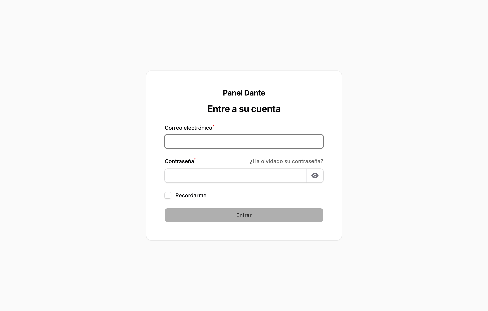
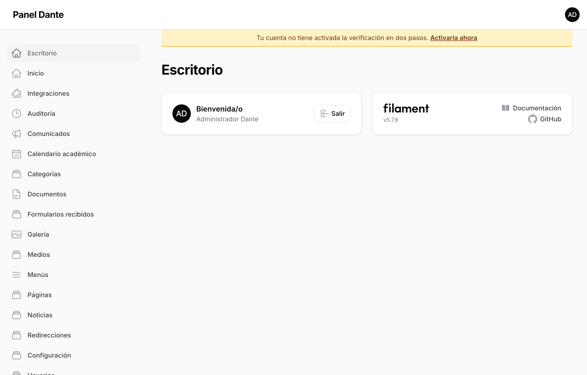
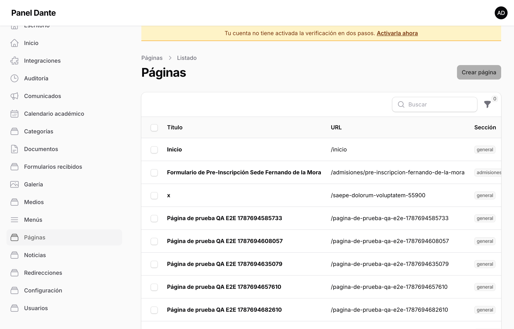
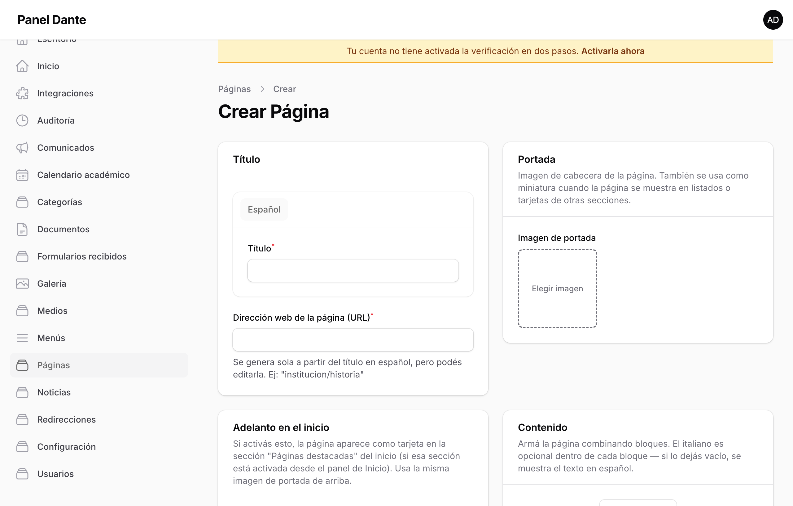
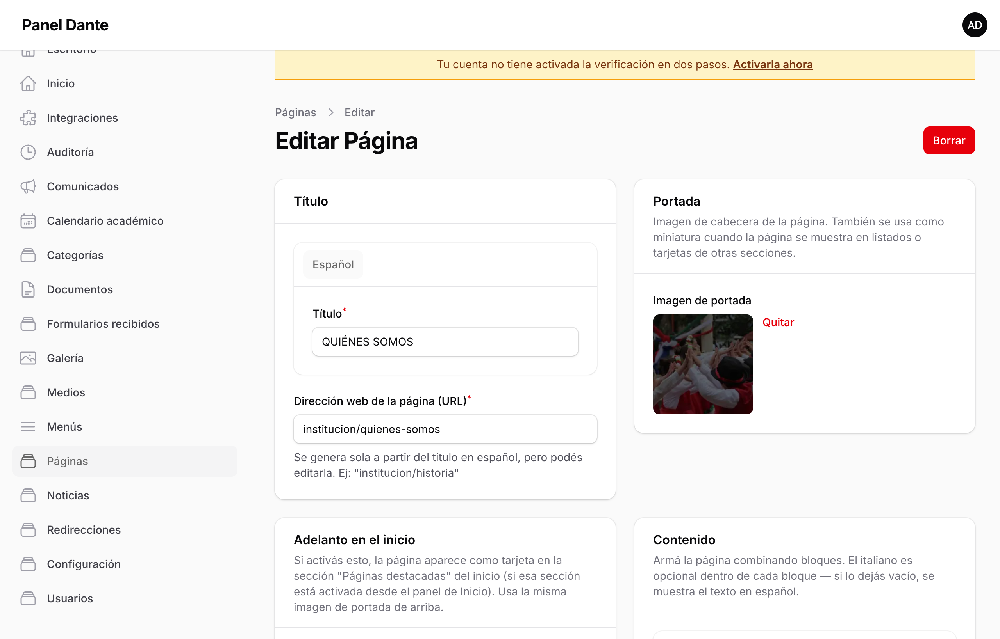
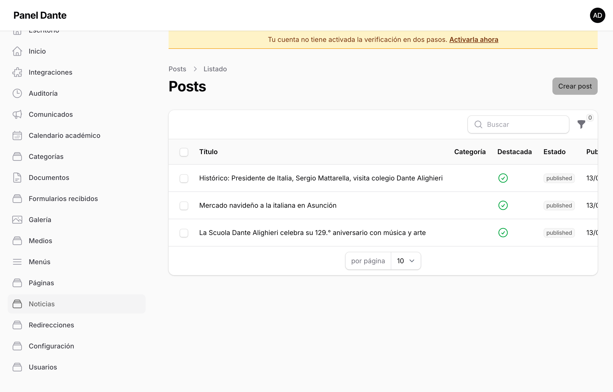
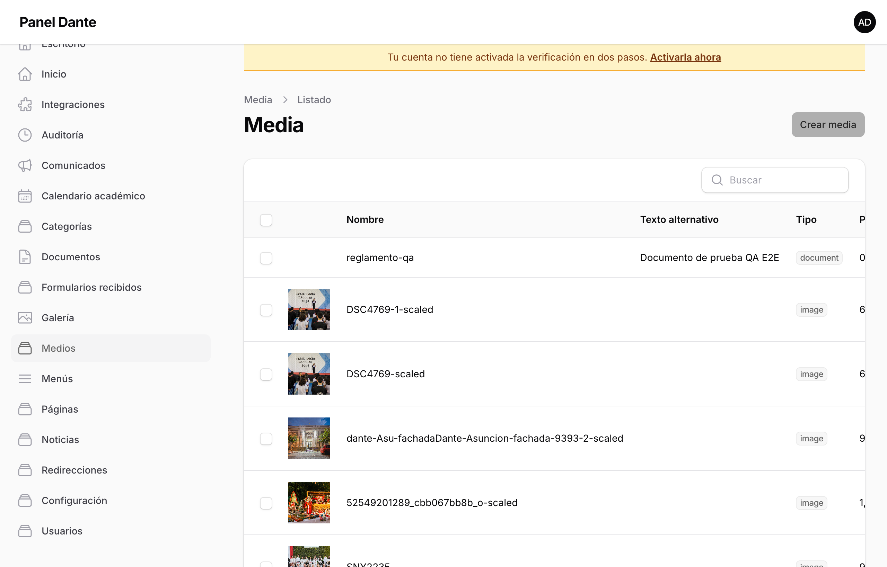
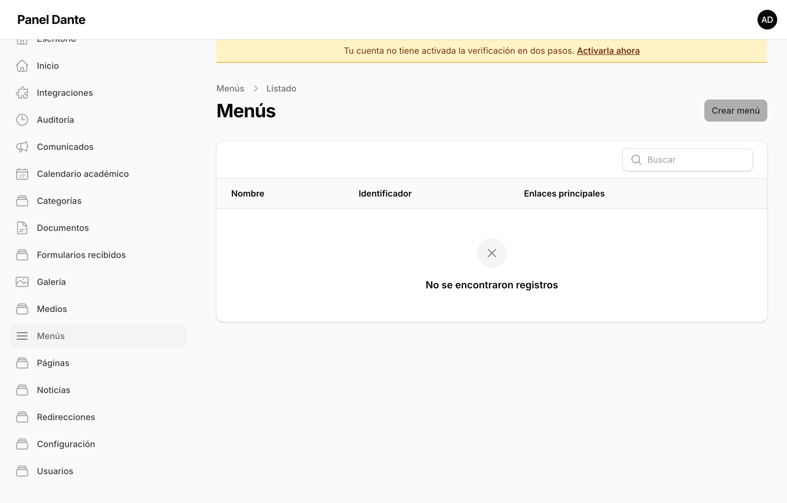
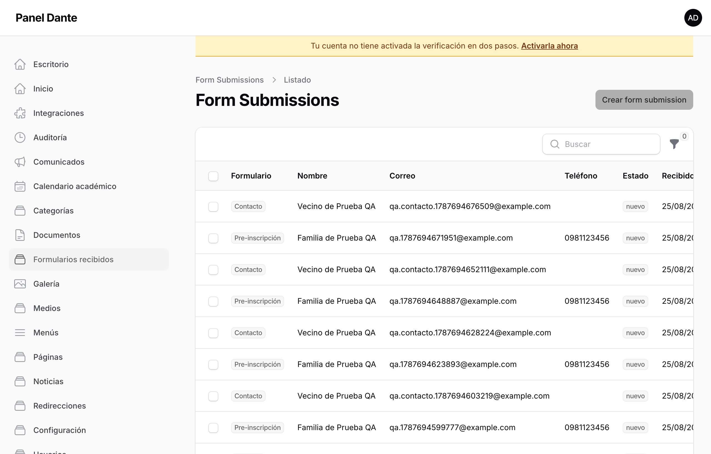

# Manual del panel — Colegio Dante Alighieri

> Guía para el personal del colegio que administra el sitio web. Capturas tomadas del
> entorno real del panel (Fase 10, 2026-08-26) — se actualizan si cambia algo visible acá
> antes de la entrega final al cliente.

---

## 1. Ingresar al panel

Entrá a la dirección del panel que te dio webparaguay (no es una dirección adivinable por
seguridad — la vas a tener guardada como favorito del navegador). Ingresá tu correo y
contraseña.

Si activaste la verificación en dos pasos (recomendado, ver §8), después de la contraseña te
va a pedir un código de 6 dígitos que llega a tu correo.

Una vez adentro, vas a ver el **Escritorio**: un resumen con tu nombre y los accesos rápidos.
Del lado izquierdo está el menú con todo lo que podés administrar.

---

## 2. Crear y editar una página

Las páginas son el contenido fijo del sitio: Institución, Niveles educativos, Admisiones,
Contacto, etc. — todo lo que no es una noticia con fecha.

1. En el menú lateral, hacé clic en **Páginas**.
2. Vas a ver el listado completo, con su estado (**Borrador** o **Publicada**), su sección y
   la fecha de la última edición.

   

3. Para crear una nueva, hacé clic en **Crear página** (arriba a la derecha del listado).

   

4. Completá el **Título** — la URL (el "slug") se genera sola a partir del título, pero la
   podés cambiar si querés.
5. Elegí la **Sección** a la que pertenece (esto define en qué parte del menú aparece).
6. Armá el contenido con **bloques**: cada página se arma agregando bloques uno debajo del
   otro (texto, imagen, galería, acordeón de preguntas frecuentes, cifras destacadas, etc.).
   Podés reordenarlos arrastrándolos, editarlos haciendo clic, o borrarlos con la papelera.

   

7. Completá los campos de **SEO** (título y descripción para buscadores) si querés
   personalizarlos — si los dejás vacíos, el sitio arma unos por defecto razonables.
8. Elegí si la página queda en **Borrador** (nadie la ve todavía, la podés seguir editando)
   o **Publicada** (ya es visible en el sitio real).
9. Guardá con el botón correspondiente al final del formulario.

**Para editar** una página existente, hacé clic en su nombre o en el botón **Editar** del
listado.

---

## 3. Publicar una noticia

1. En el menú lateral, hacé clic en **Noticias**.

   

2. El proceso es igual al de una página: **Crear**, completar título/contenido/imagen de
   portada, elegir categoría, y **Publicada** para que salga en el sitio.
3. Una noticia marcada como **Destacada** aparece resaltada en el listado público y en el
   inicio (si esa sección está activada, ver §6).

---

## 4. Subir y usar imágenes

1. En el menú lateral, hacé clic en **Medios**.

   

2. Ahí ves todas las imágenes y documentos ya subidos. Podés subir uno nuevo con el botón de
   subida, o simplemente arrastrar el archivo.
3. **No hace falta subir la imagen por separado antes de usarla en una página o noticia**:
   cualquier campo de imagen (portada, bloque de imagen, etc.) tiene su propio selector que
   te deja subir un archivo nuevo o elegir uno ya subido, en el momento.
4. El sistema convierte automáticamente las imágenes a un formato liviano (WebP) y genera
   varios tamaños — no hace falta que subas la imagen ya optimizada, pero sí conviene no
   subir fotos de varios megas sin comprimir si el celular/cámara las genera muy pesadas.
5. Tipos de archivo aceptados: imágenes (jpg, png, webp, gif, svg), PDF, Word, Excel y video
   mp4. Cualquier otro tipo de archivo se rechaza automáticamente por seguridad.

---

## 5. Editar los menús de navegación

1. En el menú lateral, hacé clic en **Menús**.

   

2. Ahí se define qué aparece en el menú principal (arriba del sitio) y en el pie de página.
3. Podés agregar un enlace nuevo, reordenarlo arrastrándolo, armar submenús (menús
   desplegables), o quitar algo sin borrar la página a la que apuntaba.

---

## 6. La página de Inicio

La portada del sitio (Inicio) tiene su propia pantalla de configuración, separada de las
páginas normales — porque tiene piezas especiales: el carrusel de imágenes principal (hero),
las cifras destacadas ("129° aniversario", etc.), y qué secciones se muestran y en qué orden
(noticias recientes, comunicados, documentos, galería).

En el menú lateral, hacé clic en **Inicio** para administrar todo esto. Cada sección tiene un
interruptor para mostrarla u ocultarla sin borrar su contenido.

---

## 7. Ver los mensajes que llegan por los formularios

Cuando alguien completa el formulario de Contacto o de Pre-inscripción en el sitio público,
el mensaje queda guardado acá, además de llegar por correo a la casilla configurada.

1. En el menú lateral, hacé clic en **Formularios recibidos**.

   

2. Ahí ves cada envío con sus datos (nombre, correo, teléfono, mensaje) y la fecha.

---

## 8. Activar la verificación en dos pasos (2FA) — recomendado

El sitio permite (pero no obliga) activar un segundo paso de seguridad al iniciar sesión: un
código que llega a tu correo, además de la contraseña. **Es muy recomendable activarlo**,
sobre todo para la cuenta de administrador.

1. Hacé clic en tu nombre (arriba a la derecha) → **Perfil**.
2. Buscá la sección "Autenticación de dos factores (2FA)" y hacé clic en **Configurar**.
3. Te va a llegar un código de 6 dígitos a tu correo — ingresalo y confirmá.
4. A partir de ahí, cada vez que inicies sesión te va a pedir ese código además de la
   contraseña.

Si no lo activás, vas a ver un aviso arriba de cada pantalla del panel recordándotelo — no te
bloquea el uso del panel, es solo un recordatorio.

---

## 9. Preguntas frecuentes

**¿Si borro una página por error, se pierde para siempre?**
No — las páginas, noticias y demás contenido no se borran de inmediato del todo; consultá con
webparaguay si necesitás recuperar algo borrado por error.

**¿Puedo tener el sitio en italiano?**
Sí, el sitio soporta español e italiano. Cada página tiene sus propios campos en ambos
idiomas — el toggle general de mostrar u ocultar el italiano se administra en
**Configuración**.

**¿Quién puede hacer qué?**
Hay distintos roles: administrador (accede a todo), editor general, editor de noticias y
marketing, y editor académico. Cada uno ve en el menú lateral solo lo que le corresponde.

**¿Qué hago si algo no funciona o tengo una duda?**
Contactar a webparaguay por el canal de soporte acordado (ver el acuerdo de mantenimiento,
`docs/12-deploy-plesk.md` §8).

---

## 10. Sesión de capacitación

Además de este manual, se graba una sesión de capacitación en video recorriendo estos mismos
pasos con quien vaya a administrar el sitio en el día a día — la persona capacitada
inicialmente no siempre es quien termina usando el panel, por eso la grabación queda
disponible para quien la necesite después. **Pendiente de agendar con el cliente antes del
cutover** (Fase 10, `docs/12-deploy-plesk.md` §7).
